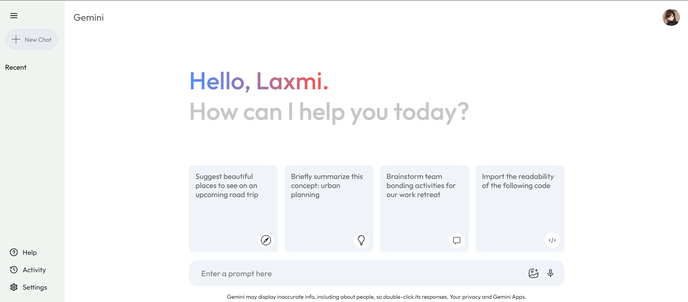
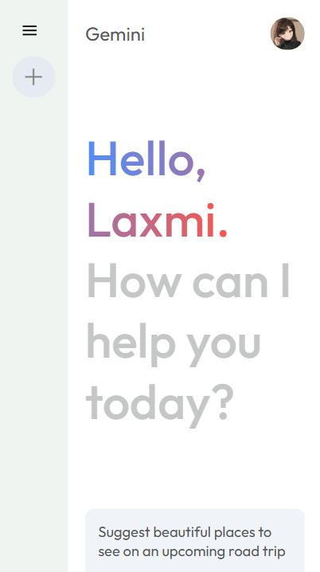

# 🌟 Gemini AI Chat Clone

A fully functional, responsive Gemini AI chat application built using **React** and **Google Generative AI API**.

## 🚀 Features

- 🧠 Chat with Google Gemini (Generative AI)
- 💬 Real-time message handling
- 🎨 Responsive design for mobile & desktop
- ⚙️ Configurable model and API key
- 🌙 Clean and minimal user interface

## 🛠️ Tech Stack

- **Frontend**: React, CSS
- **API**: Google Generative AI (Gemini) API
- **Build Tool**: Vite

## 📸 Screenshots
| Laptop View | Mobile View |
|-----------|-----------------|
|  |  |

## 📦 Installation

```bash
git clone https://github.com/your-username/gemini-clone.git
cd gemini-clone
npm install
npm run dev